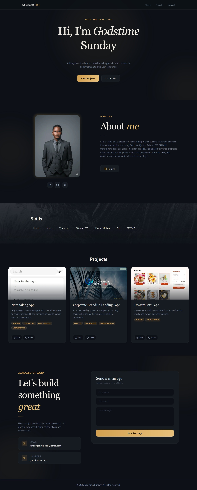
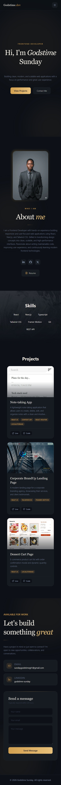

# Godstime Sunday — Portfolio

A clean, modern, and responsive personal portfolio built with **Next.js**, **Framer Motion**, **shadcn/ui**, and **Tailwind CSS v4**.
Showcases my projects, skills, and contact information — with automatic light/dark mode detection and a refined amber design system.

Live site: [sgodstime.vercel.app](https://sgodstime.vercel.app)

---

## Screenshots

<table>
  <tr>
    <td width="70%"></td>
    <td width="30%"></td>
  </tr>
</table>

---

## Features

- **Next.js 16 (App Router)** — Fast, scalable, and SEO-friendly
- **Framer Motion** — Smooth scroll-triggered animations and micro-interactions
- **shadcn/ui** — Accessible, customizable UI primitives
- **Lucide React** — Lightweight, consistent iconography
- **Responsive Design** — Optimised for desktop, tablet, and mobile
- **System Theme Detection** — Automatically switches between light and dark modes
- **Amber Design System** — Cohesive CSS variable-driven colour palette across all sections

### Sections

`Hero` · `About` · `Projects` · `Contact`

---

## Tech Stack

| Category      | Technology                         |
| ------------- | ---------------------------------- |
| Framework     | Next.js 16 (App Router)            |
| Animations    | Framer Motion                      |
| UI Components | radix-ui                           |
| Icons         | Lucide React · React Icons         |
| Styling       | Tailwind CSS v4 with CSS Variables |
| Email         | EmailJS                            |
| Hosting       | Vercel                             |

---

## Getting Started

**Clone the repository:**

```bash
git clone https://github.com/Gt1code/portfolio-v4.git
cd portfolio-v4
```

**Install dependencies:**

```bash
npm install
```

**Run the development server:**

```bash
npm run dev
```

Open [http://localhost:3000](http://localhost:3000) to view the portfolio.

---

## Design System

The portfolio uses a CSS variable-driven amber palette that adapts to both light and dark system preferences.

| Token              | Light Mode | Dark Mode |
| ------------------ | ---------- | --------- |
| `--bg`             | `#f5f0e8`  | `#0d1117` |
| `--card-bg`        | `#fdfaf5`  | `#161b22` |
| `--amber`          | `#b46e14`  | `#d2a050` |
| `--amber-light`    | `#c8861e`  | `#e8c07a` |
| `--text-primary`   | `#1a1612`  | `#f0ece4` |
| `--text-secondary` | `#6b6358`  | `#8b9ab0` |

All components reference these tokens — no hardcoded colours anywhere.

---

## Links

- **Live Portfolio:** [sgodstime.vercel.app](https://sgodstime.vercel.app)
- **GitHub:** [github.com/Gt1code/portfolio-v4](https://github.com/Gt1code/portfolio-v4)
