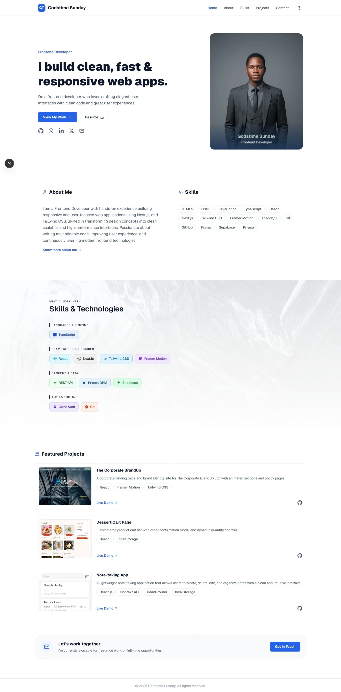

# Godstime Sunday — Developer Portfolio

Personal portfolio website built with Next.js 16 (App Router), TypeScript, Tailwind CSS v4, Lucide React, and React Icons.

Live site: [sgodstime.vercel.app](https://sgodstime.vercel.app)

## Screenshot



## Tech Stack

- **Framework**: Next.js 16 (App Router)
- **Language**: TypeScript
- **Styling**: Tailwind CSS v4
- **Icons**: Lucide React · React Icons (FA)
- **Theme**: `next-themes` (system-aware dark/light mode)
- **Deployment**: Vercel

## Project Structure

```
portfolio/
├── app/
│   ├── layout.tsx          # Root layout — fonts, ThemeProvider, metadata
│   ├── page.tsx            # Home page — assembles all sections
│   └── globals.css         # CSS custom properties (palette + sizing)
├── components/
│   ├── layout/
│   │   ├── Navbar.tsx      # Sticky nav with theme toggle
│   │   └── Footer.tsx      # Copyright + policy links
│   ├── home/
│   │   └── Hero.tsx        # Headline, CTA buttons, social links, photo
│   ├── about/
│   │   └── AboutCard.tsx   # About me snippet with link
│   ├── skills/
│   │   └── SkillsCard.tsx  # Skill badge grid
│   ├── projects/
│   │   ├── ProjectsSection.tsx   # Section wrapper + grid
│   │   └── ProjectCard.tsx       # Individual project card
│   ├── contact/
│   │   └── ContactBanner.tsx     # "Let's work together" CTA
│   └── ui/
│       ├── Badge.tsx             # Reusable skill/tag badge
│       ├── Button.tsx            # Primary + outline button variants
│       └── SectionHeading.tsx    # Icon + label section heading
├── lib/
│   ├── projects.ts         # Project data
│   └── skills.ts           # Skills data
└── types/
    └── index.ts            # Shared TypeScript interfaces
```

## Getting Started

```bash
npm install
npm run dev
```

Open [http://localhost:3000](http://localhost:3000)

## Customization

- **Content**: Edit data files in `lib/` — no component changes needed for copy/project updates.
- **Colors**: All brand tokens live in `app/globals.css` under `:root` and `.dark`.
- **Theme toggle**: Handled by `next-themes` — respects system preference on first load.

## Links

- **Live Portfolio:** [sgodstime.vercel.app](https://sgodstime.vercel.app)
- **Github:** [github.com/Gt1code/portfolio-v4](https://github.com/Gt1code/portfolio-v4)
